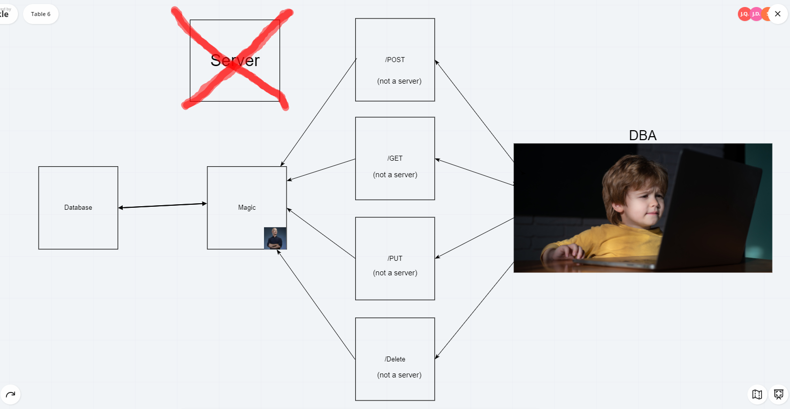

# serverless-api

### Data Flow
1. What is the root URL to your API?
  -[https://933jz29hnh.execute-api.us-east-2.amazonaws.com/test/people](https://933jz29hnh.execute-api.us-east-2.amazonaws.com/test/people)
2. What are the routes?
  - /people
    - GET and POST
  - /people/{id}
    - GET, PUT and DELETE
3. What inputs do they require?
  - /people GET requires no arguments
  - /people POST requires JSON with name & phone key value pairs (with strings)
  - /people/{id} GET requires an ID param
  - /people/{id} PUT requires an ID param and JSON object
  - /people/{id} DELETE PUT requires an ID param and empty JSON object
4. What output do they return?
  - /people GET returns all records in the table
  - /people/{id} GET returns a single JSON object for the ID sent

### Resources
- Collaborated with: Carly Dekock, Jason Quaglia, Jason Dormier, Seid MO